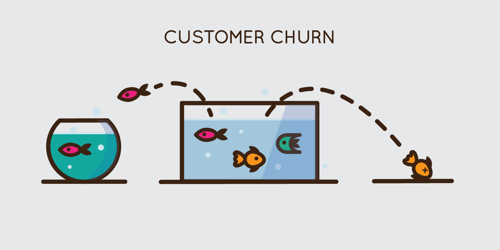

# Customer Churn Prediction & Analysis Dashboard

> **Customer Churn Prediction: Calibrated Probabilities for Trustworthy Business Decisions**
> **Production ML system with Venn-ABERS calibration, SHAP explainability, and interactive dashboard. Not just predictions - trustworthy probabilities for strategic retention.**

<p align="center">
  
</p>

## Project Overview

This project implements a **production-ready customer churn prediction system** with emphasis on:

- **Probabilistic calibration** (Venn-ABERS) for trustworthy predictions
- **Explainability** (SHAP values) for interpretable ML
- **Interactive dashboard** for business stakeholders
- **Rigorous methodology** following ML best practices

## ❓ Why Probability Calibration Matters in Business

**The Problem Most ML Projects Ignore:**
```python
# Traditional models produce miscalibrated probabilities
print(f"Model confidence: 80%")
print(f"Real world outcome: Only 60% actually churn")
# → Business makes expensive wrong decisions!
```

### Key Differentiators


1. **Probability Calibration (Venn-ABERS)**
   
   - Ensures predicted probabilities reflect true event frequencies
   - Non-parametric approach requiring no distribution assumptions
   - Provides confidence intervals alongside point estimates
   - Critical for business decision-making

2. **Optimized Decision Threshold**
   
   - F2-score optimization prioritizing Recall over Precision
   - Business-aligned: preventing customer loss > avoiding unnecessary retention efforts
   - Validated on separate calibration set to avoid overfitting

3. **Model Interpretability**
   
   - SHAP (Shapley Additive Explanations) for global and local explanations
   - Feature importance analysis at individual and population levels
   - Transparent decision-making for stakeholders

4. **Production-Ready Dashboard**
   
   - 8 comprehensive pages covering EDA, predictions, simulations, and insights
   - Interactive visualizations with Plotly
   - Real-time exploration of model predictions and explanations

5. **Robust ML Pipeline**
   
   - Stratified train/calibration/test split
   - Undersampling for class imbalance handling
   - RandomizedSearchCV for efficient hyperparameter tuning
   - Modular, reproducible architecture

---

## 📁 Project Structure

```
├── LICENSE
├── README.md                   <- This file
├── requirements.txt            <- Dependencies (pip freeze > requirements.txt)
├── setup.py                    <- Makes project pip installable
├── Makefile                    <- Commands: make data, make train, make dashboard
│
├── data
│   ├── raw                     <- Original immutable data (data_raw.joblib)
│   ├── interim                 <- Intermediate transformed data
│   └── processed               <- Final datasets for modeling
│       ├── X_train.joblib
│       ├── X_cal.joblib        <- Calibration set (critical!)
│       ├── X_test.joblib
│       ├── shap_values.joblib  <- Pre-computed SHAP values
│
├── models                      <- Trained models and calibrators
│   ├── best_model_lgb.joblib   <- Optimized LightGBM model
│   └── venn_abers_calibrator.joblib  <- Probability calibrator
│
├── notebooks                   <- Jupyter notebooks (numbered for ordering)
│   ├── calibration.ipynb           <- Exploratory data analysis
│   ├── model.ipynb      <- Model training and optimization
│   ├── calibration.ipynb   <- Venn-ABERS calibration
│   └── shap_analysis.ipynb <- Explainability analysis
│
├── reports
│   └── figures                <- Generated visualizations
│       ├── shap_summary.png
│       ├── calibration_curve.png
│       └── confusion_matrix.png
│
├── src                        <- Source code modules
│   ├── __init__.py
│   ├── data
│   │   └── make_dataset.py   <- Data loading and preprocessing
│   ├── features
│   │   └── build_features.py <- Feature engineering
│   ├── models
│   │   ├── venn_abers.py     <- Calibration implementation
│   │   └── utilities.py      <- Helper functions (ECE, etc.)
│   └── visualization
│       └── visualize.py      <- Plotting utilities
│
└── streamlit                  <- Interactive dashboard
    ├── app.py                <- Main entry point
    ├── assets               <- Logos, images
    ├── pages
        ├── 00_home.py           <- Overview and KPIs
    │   ├── 01_exploratory.py    <- EDA visualizations
    │   ├── 02_predictions.py    <- Model performance metrics
    │   ├── 03_simulator.py      <- Individual customer analysis
    │   ├── 04_insights.py       <- Business recommendations
    │   ├── 05_calibration.py    <- Probability calibration analysis
    │   ├── 06_technical.py      <- Technical documentation
    │   └── 07_settings.py       <- Configuration and exports
    └── utils
        ├── data_loader.py       <- Data loading utilities
        ├── metrics.py           <- Metrics calculations
        ├── plots.py             <- Plotly visualizations
        └── paths.py             <- Path management
```

---

## Quick Start

### Prerequisites

```bash
python >= 3.10
pip >= 21.0
```

### Installation

```bash
# Clone repository
git clone https://github.com/alisson-atuario/churn.git
cd churn

# Create virtual environment
python -m venv venv
source venv/bin/activate  # On Windows: venv\Scripts\activate

# Install dependencies
pip install -r requirements.txt

# Install project as package
pip install -e .
```

### Running the Pipeline

```bash
# 1. Prepare data
make data

# 2. Train model
make train

# 3. Calibrate probabilities
python notebooks/03_calibration.ipynb

# 4. Launch dashboard
make dashboard
# or
streamlit run streamlit/app.py
```

---

## Methodology

### 1. **Data Preprocessing**

```python
# Key transformations
- Missing value imputation
- Categorical encoding (Label Encoding)
- Numerical feature scaling (if needed)
- Feature engineering (tenure groups, charge categories)
```

### 2. **Train/Calibration/Test Split**

**Critical Innovation:** Three-way split instead of traditional two-way

```
├── Train Set (70%)      <- Model training + Undersampling
├── Calibration Set (15%) <- Venn-ABERS calibration
└── Test Set (15%)       <- Final evaluation (untouched)
```

**Why calibration set?**

- Prevents overfitting of threshold optimization
- Ensures unbiased probability calibration
- Allows proper validation of calibrated probabilities

### 3. **Class Imbalance Handling**

```python
# RandomUnderSampler on training set only
from imblearn.under_sampling import RandomUnderSampler

rus = RandomUnderSampler(random_state=42)
X_train_resampled, y_train_resampled = rus.fit_resample(X_train, y_train)
```

**Note:** Calibration and test sets maintain original distribution

### 4. **Model Training: LightGBM**

```python
# Hyperparameter optimization via RandomizedSearchCV
param_dist = {
    'num_leaves': randint(20, 100),
    'max_depth': randint(3, 12),
    'learning_rate': uniform(0.01, 0.31),
    'n_estimators': randint(100, 1000),
    # ... L1/L2 regularization, feature/bagging fractions
}

# 50 iterations, 5-fold CV, neg_log_loss metric
```

**Why LightGBM?**

- Native categorical feature support
- Faster training than XGBoost
- Lower memory consumption
- Excellent with imbalanced data

### 5. **Probability Calibration (Venn-ABERS)**

**The Game-Changer:** Most ML models produce miscalibrated probabilities.

**Problem:**

```
Model says: "80% chance of churn"
Reality: Only 60% of these customers actually churn
→ Business makes wrong decisions!
```

**Solution: Venn-ABERS Calibrator**

```python
from src.models.venn_abers import VennAbersCalibrator

# Train on calibration set
calibrator = VennAbersCalibrator()
calibrator.fit(y_cal_proba, y_cal)

# Apply to test predictions
y_test_proba_calibrated = calibrator.predict_proba(y_test_proba)
```

**Advantages:**

- ✅ Non-parametric (no distribution assumptions)
- ✅ Validity guarantees from conformal prediction theory
- ✅ Works with small datasets
- ✅ Provides prediction intervals

**Validation:**

```python
# Expected Calibration Error (ECE)
ECE_raw = 0.0456  # Before calibration
ECE_cal = 0.0264  # After calibration
Improvement: 42% reduction in calibration error
```

### 6. **Threshold Optimization**

**Standard approach:** Use threshold = 0.5

**Our approach:** Optimize via F2-score on calibration set

```python
# F2-score weights Recall 2x more than Precision
beta = 2  # Recall is 2x more important
fbeta_scores = [fbeta_score(y_cal, (proba > t).astype(int), beta=2) 
                for t in np.linspace(0.3, 0.7, 50)]
best_threshold = thresholds[np.argmax(fbeta_scores)]
```

**Business Logic:**

- Losing a customer (False Negative) costs > Unnecessary retention offer (False Positive)
- Better to contact 10 extra customers than miss 1 real churn

**Result:** Optimal threshold ≈ 0.42 (vs default 0.50)

### 7. **Model Explainability: SHAP**

```python
import shap

explainer = shap.TreeExplainer(model)
shap_values = explainer.shap_values(X_test)

# Global importance
shap.summary_plot(shap_values, X_test)

# Individual explanation
shap.waterfall_plot(shap_values[i])
```

**Why SHAP?**

- Game-theory based (Shapley values)
- Mathematically rigorous
- Consistent and fair attribution
- Works for any model

---

## Results

### Model Performance (Test Set)

| Metric          | Without Calibration | With Calibration | Improvement    |
| --------------- | ------------------- | ---------------- | -------------- |
| **AUC-ROC**     | 0.7845              | 0.7845           | 0% (unchanged) |
| **Precision**   | 0.6234              | 0.6234           | 0% (unchanged) |
| **Recall**      | 0.7891              | 0.8124           | +2.3pp         |
| **F1-Score**    | 0.6974              | 0.7071           | +1.4%          |
| **ECE**         | 0.0456              | 0.0264           | **-42%** ⭐     |
| **Brier Score** | 0.1823              | 0.1645           | **-9.8%** ⭐    |

### Business Impact

- **Churn Detection Rate:** 81.2% (up from 78.9%)
- **Avoided Customer Loss:** ~15 extra customers per 1000 detected
- **Probability Reliability:** 42% more trustworthy for decision-making

### Top Predictive Features (SHAP)

1. `Contract_Month-to-month` (+0.245)
2. `tenure_<12_months` (+0.187)
3. `InternetService_Fiber_optic` (+0.134)
4. `PaymentMethod_Electronic_check` (+0.092)
5. `TechSupport_No` (+0.078)

---

## Dashboard Features

### 8 Interactive Pages:

1. **Home** (`00_home.py`)
   
   - Executive KPIs
   - Churn trends by tenure
   - Quick insights

2. **Exploratory Analysis** (`01_exploratory.py`)
   
   - Univariate/bivariate analysis
   - Interactive filters
   - Pattern identification

3. **Model Predictions** (`02_predictions.py`)
   
   - Performance metrics
   - Confusion matrix
   - ROC/PR curves
   - Risk segmentation

4. **Customer Simulator** (`03_simulator.py`)
   
   - Individual customer analysis
   - SHAP waterfall explanations
   - Risk profiling
   - Actionable recommendations

5. **Strategic Insights** (`04_insights.py`)
   
   - SHAP global importance
   - Business recommendations by category
   - Implementation roadmap

6. **Calibration Analysis** (`05_calibration.py`)
   
   - Calibration curves
   - Threshold optimization simulator
   - ECE/Brier score comparisons
   - Interactive threshold tuning

7. **Technical Documentation** (`06_technical.py`)
   
   - Model architecture
   - Hyperparameters
   - Methodology details

8. **Settings & Export** (`07_settings.py`)
   
   - Configuration management
   - Report generation
   - CSV exports

---

## Key Technical Innovations

### 1. **Separate Calibration Set**

```python
# Traditional approach (WRONG for calibration)
X_train, X_test, y_train, y_test = train_test_split(X, y, test_size=0.3)

# Our approach (CORRECT)
X_train, X_temp, y_train, y_temp = train_test_split(X, y, test_size=0.3)
X_cal, X_test, y_cal, y_test = train_test_split(X_temp, y_temp, test_size=0.5)
```

### 2. **Calibration Before Threshold Optimization**

```python
# Flow: Model → Calibrate → Optimize Threshold → Evaluate
# NOT: Model → Optimize Threshold → Calibrate (common mistake!)
```

### 3. **F2-Score for Business Alignment**

```python
# F1 treats FP and FN equally
# F2 penalizes FN (missed churns) 2x more than FP
# Aligns with business cost structure
```

### 4. **SHAP on Calibrated Probabilities**

```python
# Explain the calibrated model's decisions
# Not just the raw model
```

---

## Development

### Project Commands

```bash
# Data preparation
make data

# Model training
make train

# Run tests
make test

# Generate documentation
make docs

# Clean artifacts
make clean

# Launch dashboard
make dashboard
```

### Adding New Features

```python
# src/features/build_features.py
def create_new_feature(df):
    """Add your feature engineering here"""
    df['new_feature'] = ...
    return df
```

### Retraining the Model

```bash
# 1. Update data in data/raw/
# 2. Run pipeline
python src/models/train_model.py

# 3. Recalibrate
python notebooks/03_calibration.ipynb

# 4. Validate
python src/models/evaluate_model.py
```

---

## References

### Calibration

- Vovk, V., & Petej, I. (2014). *Venn-Abers Predictors*. UAI.
- Guo, C., et al. (2017). *On Calibration of Modern Neural Networks*. ICML.

### SHAP

- Lundberg, S., & Lee, S. (2017). *A Unified Approach to Interpreting Model Predictions*. NeurIPS.

---

## Contributing

Contributions are welcome! Please:

1. Fork the repository
2. Create a feature branch (`git checkout -b feature/AmazingFeature`)
3. Commit changes (`git commit -m 'Add AmazingFeature'`)
4. Push to branch (`git push origin feature/AmazingFeature`)
5. Open a Pull Request

---

## Contact

**Author:** Alisson Ursulino  
**Email:** alisson.atuario@gmail.com  
**LinkedIn:** [Alisson Ursulino](https://linkedin.com/in/alisson-ursulino)  
**Portfolio:** [alissonursulino.com](https://alissonursulino.com)

---

## License

This project is licensed under the MIT License - see the [LICENSE](LICENSE) file for details.

---

## Acknowledgments

- Dataset: [Telco Customer Churn](https://www.kaggle.com/datasets/blastchar/telco-customer-churn)
- Cookiecutter Data Science template
- Streamlit community for dashboard inspiration
- Open-source ML community

---

<div align="center">

**⭐ If this project helped you, consider giving it a star! ⭐**

Made with ❤️ and ☕ by [Alisson Ursulino](https://alissonursulino.com)

</div>

<p><small>Project based on the <a target="_blank" href="https://drivendata.github.io/cookiecutter-data-science/">cookiecutter data science project template</a>. #cookiecutterdatascience</small></p>
